# SDUI Platform — Requirements Summary & Key Decisions

> Consolidated from design sessions covering schema, codegen, rendering, data binding, action system, and state management. Includes gap analysis against Airbnb (Ghost Platform), Lyft, DoorDash, and Spotify SDUI implementations.

> **Prototype naming note:** This document uses conceptual names (SDUIStateManager, SDUIActionExecutor, SDUIScreenStateManager) to describe the architectural roles. The working prototype uses simplified names (e.g., `SduiScreenViewModel`, `ActionHandler`, `StateManager`) — the concepts are the same, the class names differ.

> **Scope note (normative):** This document is the requirements source of truth. Diagrams and payload snippets are illustrative and non-normative unless explicitly called out as requirement statements.

## 5-Minute Reader Guide

- Start here for current commitments: `Current Governance (This Document)`
- Architecture requirements: `1. Core Architecture` and `2. Schema Design`
- Runtime behavior requirements: `3. Data Binding`, `4. Action System`, `5. Screen-Level State`
- Open decision approvals: `ADR Status Summary`
- Implementation status at a glance: `10. Requirement Status Matrix`

## Governance Header Template

Use this header at the top of requirement documents to keep ownership, approval, and decision linkage explicit.

```yaml
document: <requirements-doc-name>
version: <semver-or-date-version>
status: draft|review|approved
owner: <primary-owner>
last_updated: <yyyy-mm-dd>
decision_policy:
  - "Create ADRs for decisions requiring platform and backend input."
  - "Requirements document is source of truth for what; ADRs capture why."
approvers:
  - <name-or-group>
related_adrs:
  - <adr-id-and-title>
required_inputs:
  platform: true
  backend: true
locked_decisions:
  action_precedence: "nested > section > screen-default"
  experiment_assignment: "client-authoritative via Amplitude; server trusts assignments, kill switch for disabled variants"
  request_method_policy: "GET or POST based on section/screen cacheability and context"
  ad_boundary: "ad auction/targeting delegated; SDUI carries placement contract"
  cache_policy_owner: "platform + backend"
  transition_policy: "avoid CoreAPI-adapter unless necessary; decide case-by-case"
```

### Current Governance (This Document)

- **Owner:** Adrian Robinson (temporary decision authority)
- **ADR policy:** create ADRs for decisions needing platform/backend input
- **Platform-aware composition (settled):** shared schema and data pipeline; per-platform-family composition responses. Not an ADR — the only practical architecture for phone, tablet, web, and TV. Server-side composition cost is acceptable.
- **Navigate action URIs (settled):** `targetUri` for native deeplinks, `webUrl` for web — both are first-class platform-appropriate targets, not primary/fallback.
- **Action precedence:** nested > section > screen-default
- **Experiment strategy:** client-authoritative assignment via Amplitude SDK; server trusts and uses assignments for composition
- **Experiment conflict rule:** client assignment is authoritative; server may reject disabled variants via kill switch; response echoes final variant used
- **Request method:** support both GET and POST depending on section/screen needs
- **Ads boundary:** delegated ad auction/targeting, SDUI provides placement contract
- **Cache policy ownership:** platform + backend input required
- **CoreAPI adapter transition:** avoid unless necessary; evaluate case-by-case
- **Entitlement/restriction resolution (short term):** support current client-side resolution until server-authoritative resolution is available
- **Entitlement/restriction resolution (long term):** move to server-authoritative resolution in SDUI composition; client provides device context via `device` in the request envelope
- **Caching strategy:** section-first caching + optional screen snapshot cache

---

## 1. Core Architecture

The platform follows a **server-driven composition** model where the server controls what appears on screen, how data stays fresh, and what happens on every user interaction. The client implements generic infrastructure that executes server instructions using native rendering.

**Composition ownership requirement:** SDUI semantic composition is owned by the SDUI composition layer (composer/aggregator), not by platform-specific client card logic. CoreAPI-derived composition may be used as a transitional input, but it is not the long-term semantic source of truth.

**Platform-aware composition (settled position):** The SDUI schema is universal — all platforms share the same vocabulary of section types, action types, and data models. The composition layer produces **per-platform-family responses**. A tvOS 10-foot UI, a phone, and a web browser have fundamentally different information density, interaction models, and layout requirements. Serving identical responses to all platforms forces a lowest-common-denominator experience that is unacceptable.

What is shared across all platforms:
- Schema definitions (JSON Schema) — the universal contract
- Codegen (typed models per platform from one schema)
- Upstream data fetching and transformation — one integration pipeline
- Section-type semantics — a `BoxscoreTable` means the same thing everywhere

What differs per platform family:
- Which sections are composed and in what order
- Information density and layout intent
- Action URIs (`targetUri` for native deeplinks, `webUrl` for web)
- Image dimensions and density parameters
- Interaction triggers (touch vs. D-pad focus vs. hover)

The client sends its platform identity in the request envelope. The composition service routes to the appropriate composer. The cost is additional server-side composition logic — this is acceptable and is where the investment should go.

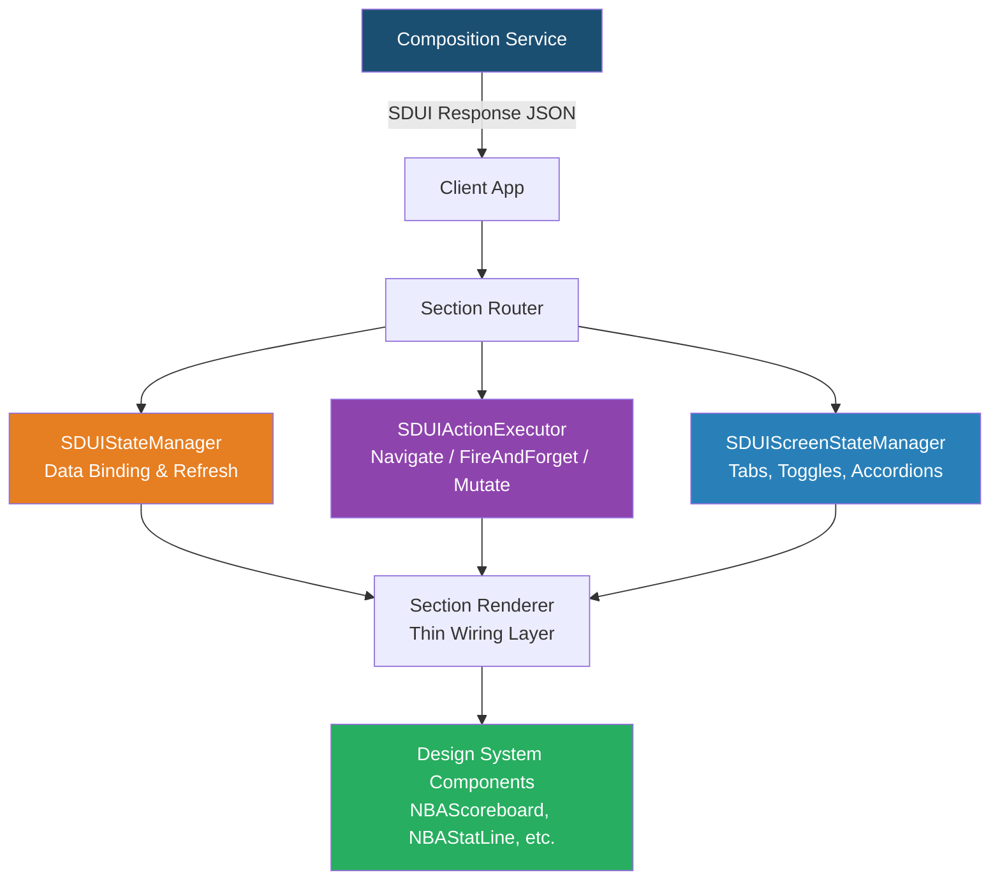

### Server Controls vs. Client Controls

| Server Controls | Client Controls |
|---|---|
| Which sections appear and in what order | Native rendering (SwiftUI / Compose) |
| What data each section shows | Design system theming and animation |
| How data stays fresh (dataBinding) | Platform-specific transport (URLSession / OkHttp) |
| What happens on every interaction (actions) | Accessibility traits |
| Which analytics fire and where | TV focus management |
| Navigation destinations and presentation style | Gesture recognition |
| Tab structure and selection behavior | Deeplink resolution logic |
| A/B test variants | Analytics SDK integration |
| Back navigation target (`parentUri`) | Back button rendering and gesture |

---

## 2. Schema Design

The schema is a JSON Schema document that your org defines and owns. It is the **single source of truth** that drives codegen (typed data models), server responses, and contract testing.

### Section Anatomy — Every Section Carries Five Things

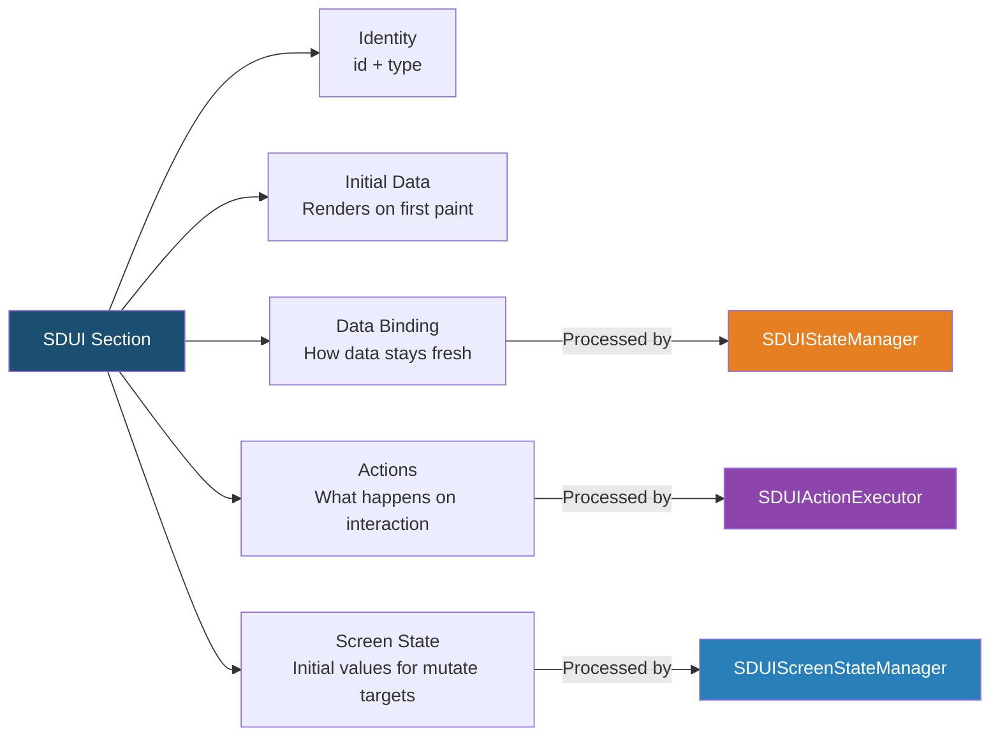

### Key Schema Decisions

- **Dual-layer type model** — 9 **section types in schema** (8 permanent with client renderers: BoxscoreTable, SeasonLeadersTable, Form, TabGroup, SubscribeBanner, SubscribeHero, AdSlot, VideoPlayer — plus the `AtomicComposite` bridge), plus 11 **atomic element types** (Container, Text, Image, Button, Spacer, Divider, ScrollContainer, Conditional, DisplayGrid, SectionSlot, LiveClock) for server-composed generic layouts. 10 former section types (ErrorState, SectionHeader, PromoBanner, ContentRail, FollowingRail, HeroPanel, StatLine, VideoCarousel, NbaTvSchedule, **GamePanel**) have been **migrated to atomic** — server-composed as `AtomicComposite` with zero client renderers and their schema definitions pruned. Live-score surfaces that previously used the `GamePanel` section now compose as `AtomicComposite` trees driven by `bindRef` leaf-level data resolution plus the `LiveClock` primitive for client-owned tick animation. Permanent sections handle stateful domain logic (sort, frozen columns, forms, platform SDK integration — IAP, ads, video); atomic primitives handle server-composed layouts with no client business logic. See *Grid vs. Section Decision Tree* in §9q.
- **Codegen produces data models only** — not UI code. Platform teams write a thin renderer layer (~30 lines per section type) that wires generated models to existing design system components.
- **Schema is versioned** — client sends its schema version, server responds with a compatible payload. Fields can never be removed without a major version bump.
- **Subsection actions are required** — `actions` must be supported at section and nested component/subsection level (for example, tapping home team area within a game section).
- **Request context is contract input** — composition must support a typed request envelope (platform, app version, locale, device context, experiments, capabilities, traceId).
- **Server-driven back navigation** — `Screen.parentUri` (optional) tells the client where the back button should navigate.  Omit for root screens.  Clients always show the back button on non-root screens.

### Prototype Concessions

| Concession | Rationale | Migration Path |
|-----------|-----------|----------------|
| ~~Android `GENERIC` screen-type enum~~ | ~~Scoreboard and game-detail have pre-existing Ably/polling transport wiring that is coupled to screen type.~~ | ✅ **Resolved.** `ScreenType` enum removed. All screens use a single URI-driven load path; transport behavior derived from `refreshPolicy` fields. |
| ~~`resolveEndpoint()` special case (`nba://game/{id}` → `game-detail/{id}?gameState=live`)~~ | ~~Preserves backward compatibility with the existing game-detail endpoint path and required query parameter.~~ | ✅ **Resolved.** `resolveEndpoint()` now performs a straight `nba://` → `/sdui/` prefix swap with no special cases. |
| Variant selector is a developer tool | Variant chips are hardcoded client-side UI, not server-driven. Real A/B would use experiment assignment. | Remove variant selector; server resolves variant via the request-envelope `experiments` map. |

---

## 3. Data Binding System

Addresses real-time requirements for live game data. The server specifies how each section's data stays fresh after first render.

### Channel Types

| Channel | Use Case | Mechanism |
|---|---|---|
| `static` | Content that never changes mid-session | No refresh |
| `poll` | Standings, stats (slow-changing) | Configurable interval (e.g., 30s) |
| `sse` | Live scores, game clock | Real-time stream (Ably in prototype) |

> **Note:** `websocket` was considered during design for full-duplex use cases (play-by-play, real-time chat) but is not in the current schema or prototype. It can be added as a future channel type.

### Binding Contract

The server specifies field-level bindings using JSONPath resolution:

```json
"dataBindings": {
  "bindings": [
    { "sourcePath": "$.homeTeam.score", "targetPath": "homeTeam.score" },
    { "sourcePath": "$.awayTeam.score", "targetPath": "awayTeam.score" },
    { "sourcePath": "$.period",         "targetPath": "period" },
    { "sourcePath": "$.gameStatusText", "targetPath": "gameStatusText" }
  ],
  "stringKeys": {
    "gameStatusText": "game_status_text"
  }
}
```

The refresh policy defines the channel separately:

```json
"refreshPolicy": {
  "type": "sse",
  "channel": "{gameId}:linescore"
}
```

**Key decisions:** The SDUIStateManager on each platform opens the channel, receives messages, resolves JSONPath sources, and patches the corresponding fields in section data. Bindings also support transforms (e.g., format a timestamp). Initial data is always included so there is **no loading spinner on first paint**.

### 3a. Binding Path Resilience

Schema evolution is additive-first, but bindings may reference paths that disappear from the data shape over time — either because the server stops sending a field, because a schema migration removes it, or because a cached layout targets a path that no longer exists in live messages. The binding runtime must handle all three cases gracefully.

#### Missing-Path Scenarios

| # | Scenario | Example | Normative Behavior |
|---|----------|---------|-------------------|
| MP-1 | Source path absent in incoming message | Server SSE message omits `$.period` for a post-game state | **Keep previous value.** Do not overwrite the target with null or a zero-value. Log a structured warning: `{ sectionId, sourcePath, traceId, reason: "source_absent" }`. |
| MP-2 | Source path removed by schema evolution | Server v2 renames `$.gameStatusText` to `$.statusLabel`; cached layouts still bind to the old path | **Keep previous value.** Binding is silently stale. The consecutive-miss counter (below) detects this condition in production. |
| MP-3 | Target path absent in cached section data | A cached layout references `homeTeam.seed` but the live response no longer includes a `seed` field in the initial data | **Auto-create intermediate objects** and set the value. This is already the behavior of `setTargetPath()`. No special handling needed. |

All three cases MUST be non-destructive: the client MUST NOT crash, show error UI, or clear the field. The keep-previous-value behavior is mandatory across all platforms.

#### Consecutive-Miss Counter

When a binding's source path is absent (MP-1 or MP-2) across multiple consecutive refresh cycles, it indicates a systemic mismatch rather than a transient omission. Clients MUST track consecutive misses per binding per section:

- **Counter key:** `{sectionId}:{sourcePath}`
- **Increment:** Each time `resolveSourcePath()` returns null/undefined for that binding during a refresh or SSE message
- **Reset:** When `resolveSourcePath()` successfully returns a non-null value for that binding
- **Threshold:** After `MISS_THRESHOLD` (default: 3) consecutive misses, log at WARN level with structured fields: `{ sectionId, sourcePath, consecutiveMisses, traceId }`
- **Analytics (deferred):** When analytics infrastructure is available, emit a `binding_path_missing` event at the threshold so the team can detect stale bindings in production dashboards

The existing `applyBindings()` null-guard (`IF sourceValue IS NULL: CONTINUE`) is the runtime implementation of MP-1 and MP-2. The consecutive-miss counter adds observability on top of that existing behavior.

#### Cleanup

When a section is removed from the screen (e.g., navigation away, screen refresh replaces section list), clients MUST clear the miss counters for that section to prevent memory leaks.

### 3b. Per-Section Staleness Tracking

Each section with a non-static `refreshPolicy` has its own data channel (SSE or poll). These channels can fail independently — one section's Ably subscription may disconnect while another section's poll continues succeeding. Clients MUST track staleness at the section level, not just at the screen level.

This is **orthogonal** to the screen-level `isStale` flag from ADR-010 (which indicates the entire layout was served from HTTP cache). Per-section staleness indicates a specific data channel is degraded while the layout may be fresh.

#### Staleness Rules

| Channel Type | Stale When | Clear When |
|---|---|---|
| `sse` | Ably connection enters `disconnected` state for >**10 seconds** | Next successful SSE message received for that section |
| `poll` | **2 consecutive** poll failures (HTTP error or network timeout) | Next successful poll response |
| `static` | Never stale (no data channel) | N/A |

#### Client Requirements

- Track a `staleSections: Set<sectionId>` that is the **union** of action-refresh failures (existing behavior) and channel-health failures (new behavior)
- Render a section-level staleness badge on affected sections (visual treatment is platform-specific)
- Section staleness badges are **independent** of the screen-level offline banner — both can be shown simultaneously (see ADR-010 Two-Phase Staleness failure mode matrix)
- When a stale section recovers (channel succeeds), clear its badge immediately — do not wait for a full screen refresh

#### Poll Backoff

When poll failures trigger staleness, apply exponential backoff to the poll interval to avoid hammering a degraded endpoint:
- On each failure: double the current interval (minimum: original `intervalMs`)
- Cap at **30 seconds** regardless of original interval
- On success: restore the original `intervalMs` immediately

---

## 4. Action System

Defines server-controlled interactivity. Every interactive component carries an `actions` map where keys are interaction triggers and values are ordered arrays of actions that execute sequentially.

**Scope requirement:** actions are supported at multiple levels:
- screen-level defaults (optional)
- section-level actions
- nested/subcomponent actions (subsection interaction targets)

When both parent and child define actions for the same trigger, child action scope takes precedence unless explicitly composed.

### Interaction Triggers (6 types — 4 in current schema)

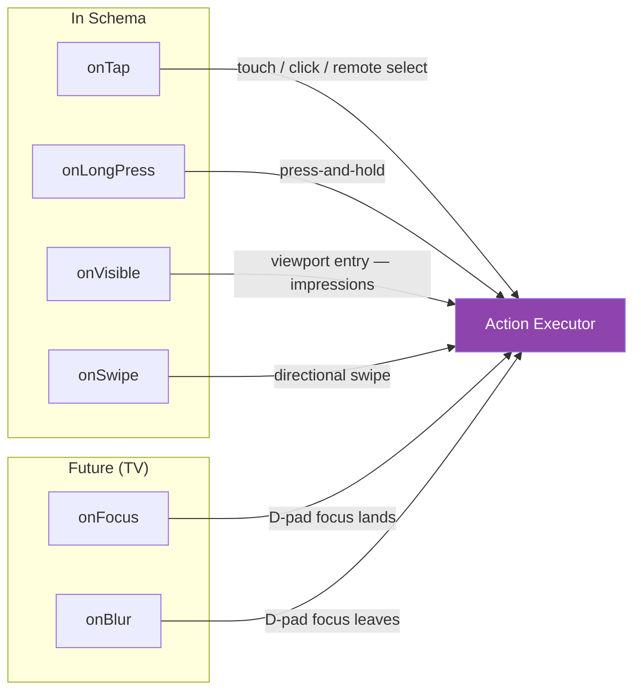

### Action Types (6 categories)

| Type | Purpose | Key Fields |
|---|---|---|
| **navigate** | Go somewhere | `targetUri` (native deeplink), `webUrl` (web equivalent), `presentation` (push/modal/fullscreen/replace/external), `modalHeight` (compact/half/full) |
| **fireAndForget** | Fire a beacon | `event` (name), `params` (arbitrary k/v), `destinations` (adobe/firebase/internal/all) |
| **mutate** | Change local UI state | `target` (state key), `operation` (set/toggle/increment/append), `value` |
| **dismiss** | Close modal/overlay/screen | `target` (modal/overlay/screen) |
| **refresh** | Force re-fetch | `target` (section ID, or omit for full screen) |
| **toast** | Show notification | `message`, `duration` |

### Composability — Single Trigger, Multiple Actions

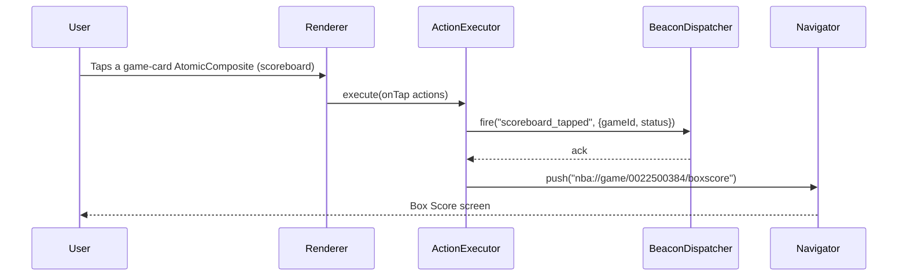

Actions fire in order. Fire-and-forget actions execute before navigation so the beacon is guaranteed to send even if navigation takes over the UI.

### Action Failure Semantics

Each action carries an optional `onFailure` field (`halt` | `continue` | `silent`) that tells the client what to do when the action fails. If absent, the client applies a per-type default:

| Action Type | Default `onFailure` | User Feedback | Sequence Effect |
|---|---|---|---|
| **fireAndForget** | `silent` | None | Continue |
| **mutate** | `continue` | None (log warning) | Continue |
| **navigate** | `halt` | Platform-native error with server message or generic localized fallback | Halt |
| **refresh** | `continue` | Stale indicator on affected section | Continue |
| **dismiss** | `silent` | None | Continue |
| **toast** | `silent` | None | Continue |

Actions may also carry an optional `failureFeedback` object with a server-provided `message` and presentation `style` hint (`snackbar` | `toast` | `inline`). Clients fall back to a generic localized string (e.g., "Unable to open page") when this field is absent.

### Sequence Execution Contract

Actions on a single trigger execute **in declared order**. The executor resolves failure policy for each action as:

```
policy = action.onFailure ?? default_for(action.type)
```

Rules:

1. **`silent`** failures are swallowed — no user feedback, sequence continues.
2. **`halt`** failures stop the sequence — user feedback is shown (server `failureFeedback.message` if present, else generic localized fallback). No subsequent actions fire.
3. **`continue`** failures log a warning, apply any type-specific side effect (e.g., stale indicator for refresh), and proceed to the next action.
4. **Already-fired actions are committed.** There is no rollback. Fire-and-forget actions capture what the user *attempted*, not what succeeded.
5. **Navigate success also halts** — navigation takes over the screen, so subsequent actions are moot regardless of `onFailure` value.

---

## 5. Screen-Level State Management

Separate from section-level data binding. Holds state variables that `mutate` actions modify — enabling tabs, toggles, accordions, and expand/collapse without hardcoded client behavior.

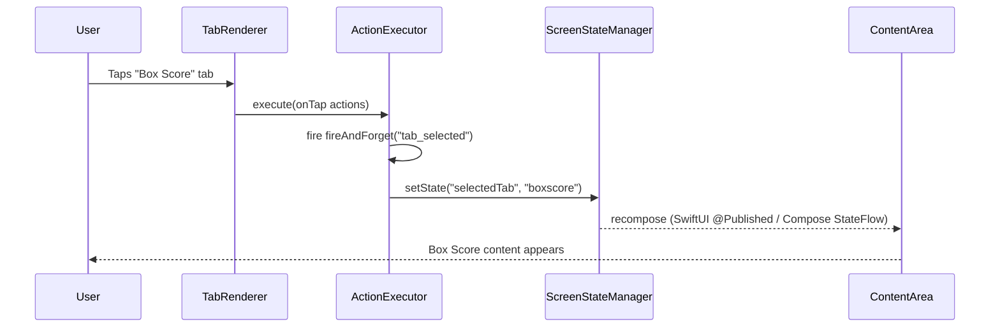

**Key decision:** Screen state is scoped to the current screen and not persisted. The server defines initial values in the section's `state` field. The client's SDUIScreenStateManager is initialized from these values and shared across all sections on the screen.

---

# Analytics Beacon Management & Impression Deduplication

> Standalone section — merge into the main SDUI Requirements Summary where appropriate.

---

## How Analytics Beacons Work in the SDUI Platform

Analytics is fully server-driven. The composition service attaches fireAndForget actions to section triggers, the client's generic action executor dispatches them to existing analytics SDKs. No per-section analytics code exists on the client.

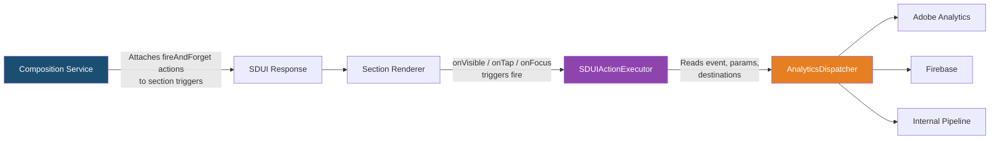

### Responsibility Split

| Layer | Responsibility |
|---|---|
| **Composition Service** | Decides what beacons to attach — event name, every param, which backends receive it. Owns the event taxonomy. |
| **Action Schema** | Defines the contract — what a fireAndForget action object looks like (type, event, params, destinations). |
| **SDUIActionExecutor** | Dispatches fireAndForget actions to the existing AnalyticsDispatcher. Does not know what section type fired it. Generic across all sections. |
| **AnalyticsDispatcher** | Existing SDK already in the app. Routes to Adobe, Firebase, internal pipeline based on `destinations` array. Unchanged by SDUI. |
| **Section Renderer** | Wires triggers (onVisible, onTap, onFocus) to the executor. Does not know the action is fireAndForget — just passes the action array through. |

### What the Server Controls

The server defines the complete analytics payload. The client never assembles beacon data from section fields.

```json
{
  "type": "fireAndForget",
  "event": "section_impressed",
  "params": {
    "sectionId": "scoreboard-001",
    "sectionType": "AtomicComposite",
    "gameId": "0022500384",
    "gameStatus": "live",
    "variant": "live-game-v2",
    "position": 0,
    "experimentId": "game-detail-redesign",
    "experimentVariant": "treatment-b"
  },
  "destinations": ["adobe", "internal"]
}
```

To add a param, change which backends receive an event, or add analytics to a section that previously didn't track anything — it's a server-side change. No app update, no PR to five platforms, no app store review.

### Beacon Trigger Types

| Trigger | Analytics Use Case | Fires When |
|---|---|---|
| `onVisible` | Impression tracking | Section enters viewport |
| `onTap` | Engagement tracking | User taps/clicks/selects |
| `onLongPress` | Secondary engagement | User long-presses (mobile) |
| `onFocus` | Browse tracking (TV) | D-pad focus lands on section |
| `onBlur` | Dwell time calculation | D-pad focus leaves section |
| `onSwipe` | Carousel interaction | User swipes within section |

---

## Impression Deduplication

### The Problem

Without deduplication, `onVisible` fires every time a section enters the viewport. User scrolls past the scoreboard, scrolls back up — the impression fires twice. For a long screen with 10+ sections, casual scrolling generates dozens of duplicate impressions per session, polluting analytics data and inflating impression counts.

### Server-Defined Dedup Policy

Deduplication policy is defined per fireAndForget action in the server response, not hardcoded in the client. This allows the analytics team to tune behavior without app updates.

```json
{
  "type": "fireAndForget",
  "event": "section_impressed",
  "params": { "sectionId": "scoreboard-001" },
  "destinations": ["adobe", "internal"],
  "impression": {
    "dedup": "once-per-screen",
    "threshold": {
      "visibility": 0.5,
      "dwellMs": 1000
    }
  }
}
```

### Dedup Strategies

| Strategy | Behavior | Use Case |
|---|---|---|
| `none` | Fire every time trigger activates | Scroll depth tracking, heatmaps |
| `once-per-screen` | Fire once per screen visit. Re-entering the screen (navigate away and back) resets. | Standard impression tracking — **recommended default** |
| `once-per-session` | Fire once per app session. Survives screen transitions, resets on app restart. | High-value impressions (hero banner, premium placement) |
| `once-per-interval` | Fire at most once per N seconds. Useful for scroll-heavy sections. | Play-by-play, infinite scroll content |

### Visibility Threshold

Controls how much of a section must be visible and for how long before the impression counts.

| Field | Type | Default | Description |
|---|---|---|---|
| `visibility` | float (0.0–1.0) | `0.5` | Fraction of section area visible in viewport. 0.5 = 50% visible. |
| `dwellMs` | integer | `1000` | Milliseconds the section must remain visible before firing. Prevents rapid-scroll false positives. |

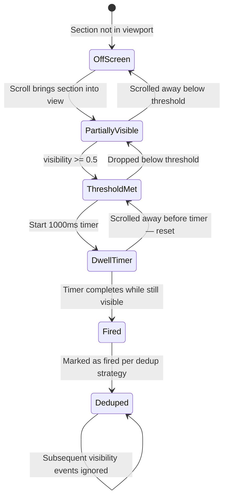

### How It Integrates with the Action Executor

The impression tracker sits between the renderer's visibility report and the action executor's dispatch:

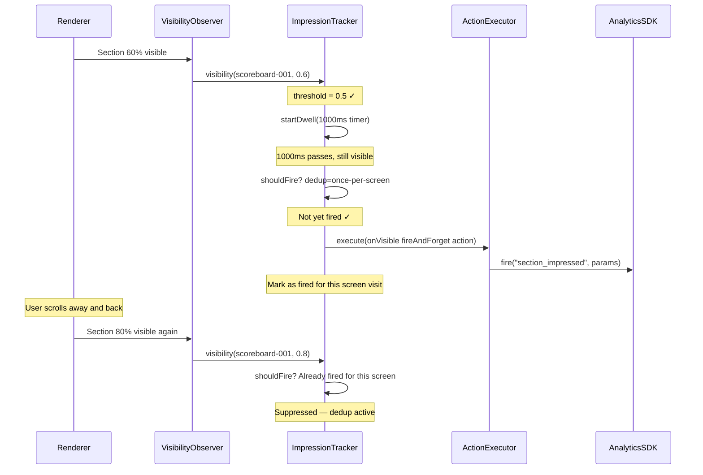

---

## Decisions Made

| Decision | Choice | Rationale |
|---|---|---|
| Where does dedup policy live? | Server-defined per fireAndForget action | Analytics team tunes without app updates |
| Default dedup strategy | `once-per-screen` | Industry standard — Airbnb, DoorDash use similar |
| Default visibility threshold | 50% area visible | IAB standard for digital ad impressions |
| Default dwell time | 1000ms | Filters rapid-scroll false positives without losing legitimate impressions |
| Where does dedup tracking live? | `SDUIImpressionTracker` (new class, used by ActionExecutor) | Keeps executor clean, tracker is testable in isolation |
| Tap/engagement analytics dedup? | No dedup — always fire | Every tap is intentional user action, should always track |
| Screen scope reset? | On screen re-entry (navigate away + back) | Standard session analytics behavior |

## Open Decisions

Pending impression semantics decisions are tracked in [ADR-009](adr/009-impression-dedup-and-visibility-semantics.md) and reviewed through the ADR approval flow.


---

## 6. Client Infrastructure — Written Once

Three platform-agnostic systems, each implemented once per platform (iOS/tvOS and Android/Fire TV):

| System | Responsibility | Inputs |
|---|---|---|
| **SDUIStateManager** | Opens SSE/poll channels, patches data fields via bindings | `dataBindings` from section |
| **SDUIActionExecutor** | Dispatches navigate/fireAndForget/mutate/dismiss/refresh to existing app systems | `actions` from section |
| **SDUIScreenStateManager** | Holds mutable screen state for tabs/toggles/accordions | `state` from section |
| **Section Renderer** | Thin wiring: reads state, maps to design system component, attaches gesture triggers | All of the above |

The action executor and state manager **do not replace** existing app infrastructure (navigation stack, analytics SDK, deeplink router). They **call** those systems based on server instructions.

---

## 7. Codegen Pipeline

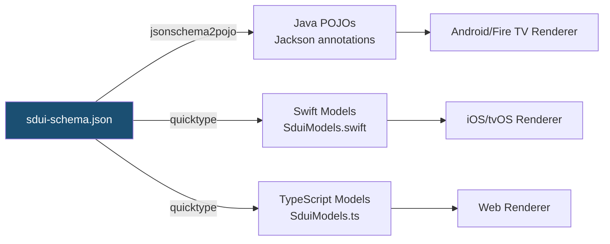

**Key decision:** Codegen generates **typed data models only** — not UI code. The renderer layer is hand-written (~30 lines per section type) because it bridges the gap between generic SDUI data and your specific design system components. This is a one-time cost per section type, not per feature change.

---

## 8. Platform Coverage

Each platform family receives a tailored composition from the server while sharing the same schema, codegen, and data pipeline. The client identifies itself via the request envelope; the composition service routes to the appropriate composer.

| Platform family | Platforms              | Renderer                         | Transport                    | Interaction model     | Composition profile |
|---|---|---|---|---|---|
| Mobile | iOS (iPhone/iPad) | SwiftUI | URLSession + EventSource | Touch gestures | Full section set, responsive breakpoints |
| Mobile | Android (Phone/Tablet) | Jetpack Compose | OkHttp + SSE client | Touch gestures | Full section set, responsive breakpoints |
| Web | Browser | React + design system | fetch + EventSource | Mouse/touch/keyboard | Wide layout, `webUrl` preferred for navigation |
| TV | tvOS (Apple TV) | SwiftUI + focusable() | URLSession + EventSource | tvOS Focus Engine | Reduced sections, large art, focus-driven |
| TV | Fire TV | Compose + onFocusChanged | OkHttp + SSE client | D-pad focus | Reduced sections, large art, focus-driven |

---

## 9. Gaps — What Airbnb, Lyft, and Others Also Handle

The following are important inclusions and decisions that production SDUI platforms deal with that we have not yet addressed:

### 9a. Accessibility (A11y) Descriptors

Airbnb's Ghost Platform and Lyft both embed accessibility metadata in the server response so screen readers, VoiceOver, and TalkBack receive correct labels without client-side hardcoding.

**What's needed:**
- `AccessibilityProperties` definition in schema with `label`, `role`, `hidden`, `headingLevel`, `liveRegion`, `sortOrder`, `hint` — referenced via `accessibility` field on `Section`, `Subsection`, and `AtomicElement`
- Server controls announcement text (e.g., "Nets 98, Knicks 104, 4:32 remaining in the third quarter") instead of relying on clients to assemble it from data fields
- Live region behavior for real-time sections (`liveRegion: "polite"` / `"assertive"` — score updates announce without user interaction)
- Focus ordering hints for TV platforms (`sortOrder` overrides default traversal order)

**Settled:** Accessibility metadata is nested under a dedicated `accessibility` field (type `AccessibilityProperties`) on `Section`, `Subsection`, and `AtomicElement`. Implemented in schema, Android (Compose `semantics {}`), and Web (ARIA attributes). See `plan-accessibility.md`.

### 9b. Conditional Rendering / Visibility Rules

Server-driven platforms need to show or hide sections based on conditions that vary across platforms and form factors.

**Settled:** Platform-level section filtering is handled **server-side** via platform-aware composition (see Core Architecture). The server sends different section sets to different platform families — a tvOS response does not include sections meant for mobile, and vice versa. This eliminates the need for client-side `{ "when": "platform", "is": "tvOS" }` conditional rules for cross-platform differences.

**Remaining gap:** Client-side responsive breakpoints within a platform family (e.g., phone vs. tablet within mobile). The atomic `Container` with `flex` and `breakpoint` properties handles simple cases. More complex responsive rules (e.g., hide a section below 768dp) may still need a lightweight client-side visibility mechanism.

**Deferred:** Client-side visibility expressions (a `visibility` field with condition evaluation on sections) were evaluated and rejected. The server already controls which sections appear via composition — feature flags, A/B gating, user-segment filtering, and time-based conditions are all resolved server-side. Adding a client-side condition evaluator would duplicate server responsibility and violate the core SDUI principle that the server owns composition. If a narrow need for state-gated visibility emerges later, it can be revisited.

**Decision required:** Whether within-family responsive rules need a `visibility` field in the schema or can be handled entirely by responsive atomic containers with `flex` and `breakpoint`.

### 9c. Error Handling & Fallback Sections

Production SDUI screens need graceful degradation when individual sections fail.

**Built:** `ErrorState` section type (Android, iOS, and web). The server can compose an explicit error section at composition time with `title`, `message`, `icon`, and optional `retryAction`. This handles cases where the server knows at composition time that data is unavailable. Server utility `SduiUtils.buildErrorSection()` standardizes error section construction.

**Built (runtime error/loading states):** `SectionStates` added to schema and codegen. The server declares `sectionStates` on each section with live data, specifying:
- `loading.skeleton` (shimmer, spinner, placeholder, none) and `loading.minHeightDp` for loading UX
- `error.message`, `error.retryAction`, `error.hideOnError` for runtime failure UX

Web client implements `SectionErrorBoundary` (React Error Boundary catching render crashes, displaying server-defined error message and retry) and `SectionSkeleton` (renders server-hinted loading skeleton). Server composers (`GameDetailComposer`, `BoxscoreComposer`) emit `sectionStates` on all SSE and poll sections via `SduiUtils.buildSectionStates()`.

**Remaining gaps:**
- Screen-level error state when the entire SDUI response fails to load
- Timeout configuration per data binding channel
- Android `sectionStates` rendering (schema and codegen done; renderer wiring pending)

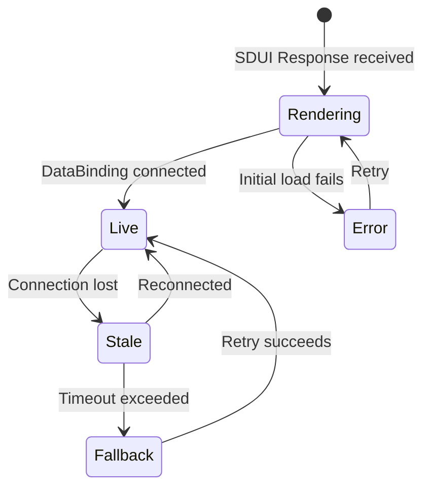

**Decision required:** Whether fallback behavior is defined per-section in the schema (server decides) or is a client-side policy. Recommendation: server-defined per section, with a client-side global default.

### 9d. Section Lifecycle & Lazy Loading

> **Status: Built** (visibility-gated refresh). See `docs/plans/plan-visibility-gated-refresh.md`.

Airbnb and DoorDash implement section-level lazy loading for long scrolling screens.

**What's needed:**
- `loading` field: `"eager"` (load immediately) vs. `"lazy"` (load when approaching viewport)
- Lazy sections include a placeholder/skeleton definition in the initial response but fetch their actual data only when scrolled into view
- This is critical for the game detail page which could have 10+ sections — you don't want to open 10 SSE connections simultaneously on screen load
- Section lifecycle management: connect data binding when visible, disconnect when scrolled far out of viewport

**What's built:**
- `pauseWhenOffScreen` field on `RefreshPolicy` (boolean, default `true`) — server controls which sections pause when off-screen
- App background/foreground lifecycle pause (Phase 0): all refresh activity stops when the app/tab is backgrounded
- Viewport visibility detection: 1.5× viewport lookahead with 500ms exit debounce (web `IntersectionObserver`, Android `LazyListState`, iOS `LazyVStack`)
- Poll gating: poll loops suspend when section leaves viewport, resume with immediate fetch on re-entry
- SSE gating: messages are buffered (latest only) when section is off-screen; applied on re-entry
- Server sets `pauseWhenOffScreen: false` on critical live-score composites that should refresh continuously

**Remaining:** Eager/lazy initial-load trigger (§9d original `loading` field) is not yet built — the current implementation gates ongoing refresh but does not defer initial data fetch.

### 9e. Caching & Offline Support

**What's needed:**
- Client-side cache of the last SDUI response for each screen, keyed by screen ID + context (e.g., game ID)
- Enables instant render on return visits (show cached, refresh in background)
- Cache TTL defined per-screen in the response: `"cache": { "ttl": 300, "strategy": "stale-while-revalidate" }`
- Offline mode: render cached response with a "last updated" indicator
- Critical for cold start performance — eliminates the 50–150ms parsing penalty on repeat visits

**Decision required:** Cache storage mechanism (memory vs. disk), eviction policy, and whether individual section data is cached independently or only the full screen response.

### 9f. Schema Versioning & Backward Compatibility

**What's needed:**
- Client sends schema version in request header: `X-SDUI-Schema-Version: 2.3`
- Server returns compatible response — never uses fields the client doesn't know about
- Unknown section types gracefully ignored (client skips, doesn't crash)
- Unknown action types gracefully ignored (executor skips, logs warning)
- Feature flags in schema for progressive rollout of new section types

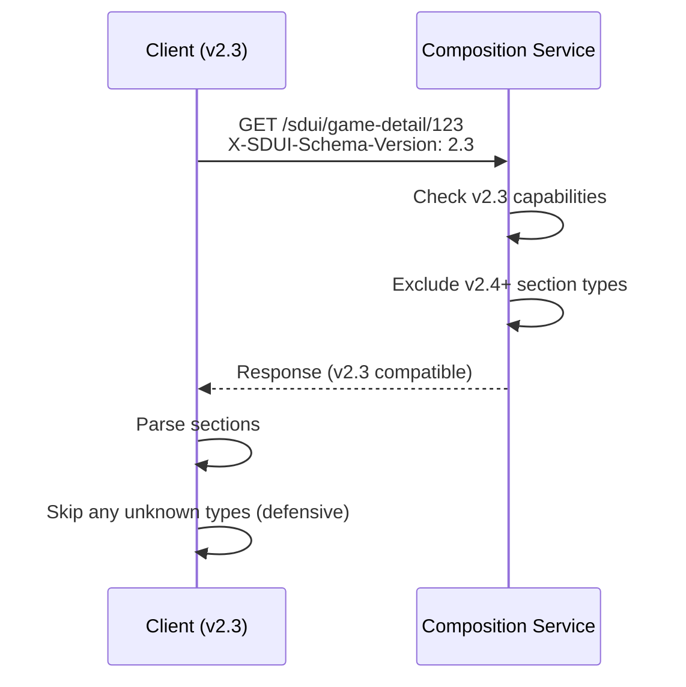

**Decision required:** Versioning strategy (semver vs. integer), how long to support old versions, and whether the server maintains multiple response templates or dynamically filters.

### 9g. Theming & Dark Mode

**Built.** Two-layer theming built across the stack, landing as the **three layers** of the SDUI design system. See the full reference at [`sdui-design-system.md`](sdui-design-system.md).

**Layer 2 — Variants (platform-native surfaces, `plan-style-token-variants.md`).** The `variant: string` field on `AtomicElement` carries per-primitive semantic presets (`ContainerVariant`, `ImageVariant`, `TextVariant`, `ButtonVariant`). Each platform resolves variants to its native design language with per-OS-tier realization: Liquid Glass / `.ultraThinMaterial` / solid-fallback on iOS (26+, 17–25, <17), Material 3 Expressive / Material You / flat Material on Android (15+, 12–14, <12), and `backdrop-filter` / solid-fallback on web (modern vs. fallback via feature detection). Dark-mode specs are mandatory at every declared tier. Per-variant override matrices (`allow` / `lock` / per-platform object) govern whether inline style properties override variant defaults; override matrices are currently hardcoded in each platform's variant resolver (not read from `style-tokens.json` at runtime). `variant_override_blocked` is emitted on Android when an inline prop tries to override a locked axis; web and iOS have override matrices in their resolvers but diagnostic emission is not yet verified. Registry: [`schema/style-tokens.json`](../schema/style-tokens.json); CI validator: [`scripts/validate-style-tokens.js`](../scripts/validate-style-tokens.js).

**Layer 3 — Color tokens (`plan-theming-design-tokens.md`).** The `ColorToken` wire type accepts either a literal hex (`#RRGGBB` / `#RRGGBBAA`) or a semantic reference (`token:color.brand.nba`, `token:color.text.primary`). The registry at [`schema/color-tokens.json`](../schema/color-tokens.json) is two-tier — **palette primitives** with literal `{ light, dark }` hex pairs, plus **semantic aliases** that point to palette primitives by name. Clients resolve tokens at render time against their hand-mirrored registry snapshots, picking light or dark from the OS color scheme (`@Environment(\.colorScheme)`, `isSystemInDarkTheme()`, `prefers-color-scheme`). Unknown tokens log `token_resolver_missing` and fall back to the caller's default color. Server composers emit tokens via a `ColorTokens` constants class (`server/src/main/java/com/nba/sdui/service/ColorTokens.java`); a `TokenRegistry` bean loads the JSON registry at startup, and a `TokenRegistryConsistencyCheck` post-construct bean fails Spring boot if any constant references a name not in the registry. Wave 1 migration covers `AtomicCompositeBuilder`, `GameDetailComposer`, `ScheduleComposer`, `LiveComposer`, `ForYouComposer`, and `DemoScreenComposer`. Remaining alpha-bearing hex literals (e.g. `#000000B3` scrims) stay inline — they encode compositing alpha, not design-system colors. Team brand primary colors (`SduiUtils.getTeamPrimaryColor`) also stay inline and cite the NBA team style guide — per NBA brand guidelines, team colors are brand assets owned by each team, not design-system tokens.

**Scope split.** Variant surface colors resolve through the platform's native semantic palette (UIKit semantic colors, `MaterialTheme.colorScheme`, CSS custom properties under `prefers-color-scheme`) and are **not** routed through the color-token registry. Brand and content colors on color-valued `AtomicElement` properties (`color`, `background`, `shadow.color`, `Divider.color`, `Shadow.color`) resolve through `ColorTokenResolver`. No overlap.

**Out of scope (by design, not deferral).** Server-composable dark mode — no `X-Theme` header exists or is planned. Dark mode is OS context owned by the client; the server is not told which mode the user is in. Brand theme takeovers (All-Star, Playoffs, sponsor windows) are intentionally not in the vocabulary; if they become a requirement they compose as variance plus a narrow themeable subset, not as platform-wide theming architecture.

**Figma pipeline.** The current color-token registry is **ref-app-seeded** — values sourced best-guess from the iOS VideoKit and Android VideoKit reference apps plus each platform's own semantic color conventions. The Figma → registry export pipeline is deferred pending design-system tooling readiness; the registry shape is Kinetic-compatible (dot-separated palette / semantic aliases) so a Figma export replaces this file wholesale when the pipeline lands. See §9s for the integration plan.

### 9h. Animation & Transition Hints

**What's needed:**
- Server can suggest entry/exit animations for sections: `"animation": { "enter": "fadeIn", "exit": "fadeOut" }`
- Score change animations (pulse, highlight) triggered by data binding updates
- Transition definitions on navigate actions already partially covered (`transition` field), but section-level animation on data change is missing

**Decision required:** Whether animations are server-suggested or purely client-side design system behavior. Recommendation: client-side default animations from the design system, with server-side override capability for special cases.

### 9i. Impression Deduplication

**Built (web):** Impression tracking implemented with `useImpressionTracking` hook using `IntersectionObserver` for viewport detection, `AnalyticsProvider` context for deduplication registry, and enhanced `ActionHandler` analytics dispatch. Supports server-defined dedup policies (`once-per-screen`, `once-per-interval`), visibility thresholds, and dwell time. ADR-009 accepted.

**Built (Android):** `SectionVisibilityTracker` + `ImpressionTracker` wired through `SduiScreenViewModel`; dedup registry + dwell-time thresholds mirror the web behaviour.

**Built (iOS):** `SectionVisibilityTracker` + `ImpressionTracker` actor in `ios/Sources/SduiCore/State/` wired into the SwiftUI section shell via `.onAppear` / `.onDisappear`; dedup policies aligned with the web and Android implementations.

**Remaining gap:** cross-platform dedup registry and analytics forwarding parity (exposure vs. impression contract, offline buffering).

**ADR tracking:** [ADR-009](adr/009-impression-dedup-and-visibility-semantics.md) — **Accepted**

### 9j. A/B Testing Integration

**What's needed:**
- Server includes experiment metadata: `"experiment": { "id": "game-detail-v2", "variant": "treatment-b" }`
- FireAndForget actions automatically include experiment context in every beacon
- Section ordering, content, and even action behavior can vary per variant
- The composition service resolves experiment assignments from the request envelope and uses them for composition branching

**Resolved decisions (see [ADR-006](adr/006-experiment-assignment-model.md), [plan-experimentation.md](plans/plan-experimentation.md) D1–D4):**

- **Client is fully authoritative.** Clients resolve assignments via experiment SDK (Amplitude) at app start (per-session) and send them as `experiments[experimentId]=variantName` in the request envelope.
- **Server trusts assignments.** `resolveVariant(experimentId, default)` reads the experiments map and branches composition. No server-side experiment resolution service.
- **Kill switch is client-side.** To disable a variant, the client stops sending that experiment. Server never sees it, falls back to default.
- **No response echo.** The client already knows its assignments — the server does not echo them back.
- **Exposure tracking is client-side** via fire-and-forget actions. No server-side exposure logging — tracking once is sufficient.
- **Experiments are natural cache keys.** Assignments travel as query parameters, so different variants produce different cache entries.
- **`variant` param removed.** Replaced by `experiments[variant]` placeholder that exercises the real experiment code path.
- **Amplitude SDK integration deferred** — not part of this plan. Experiments are manually set for now.

**ADR tracking:** [ADR-006](adr/006-experiment-assignment-model.md) — **Accepted**

### 9k. Pagination & Infinite Scroll

**What's needed:**
- Sections that contain lists (play-by-play, player stats) need server-defined pagination
- `"pagination": { "type": "cursor", "nextCursor": "abc123", "pageSize": 20 }`
- Load-more trigger: can be an `onVisible` action on a sentinel element, or an explicit "Load More" button with a refresh action targeting the section

**Decision required:** Whether pagination is a section-level concern (section fetches its own next page) or screen-level (composition service returns next batch of items within the section data).

### 9l. Debugging & Observability

**What's needed:**
- Every SDUI response carries a `traceId` that follows it from composition through rendering
- Section-level timing: when each section started rendering, when data binding connected, when first data arrived
- Action execution logging: every action fired with timestamp, trigger, and outcome
- Visual debug overlay (dev builds): tap a section to see its raw JSON, binding status, and action definitions
- Server-side: composition service logs which sections were included, which were filtered by version/experiment/platform

**Decision required:** Observability tooling — whether to build a custom SDUI debug inspector or integrate with existing tools (New Relic, etc.).

---

### 9m. Form-Factor Layout Manager

**Settled (cross-platform):** Cross-form-factor differences (phone vs. TV vs. web) are handled by platform-aware composition — each platform family receives a response composed for its form factor. The server owns section selection and ordering per platform.

**Built (within-family layout hints):** `SectionLayoutHints` added to schema and codegen. Server can specify per-section `marginTop`, `marginBottom`, `dividerAbove`, `dividerBelow`, and `priority` without client releases. Web client reads layout hints in `SectionList` and applies margins/dividers. ADR-008 accepted (Option C — hybrid: server hints + client layout engine).

**Remaining gap:** Android layout hints rendering (schema and codegen done; renderer wiring pending). Advanced layout features (multi-column, placement slots) deferred to surface expansion.

**ADR tracking:** [ADR-008](adr/008-form-factor-layout-manager.md) — **Accepted (Option C)**

### 9n. Ad Support as First-Class Primitive

**What's needed:**
- Ad placement represented in SDUI as explicit primitive/section type (for example `AdSlot`) instead of implicit module/card side-effects.
- Required fields (provider, ad unit path, sizes, targeting, collapse-on-empty behavior, refresh policy, fallback policy).
- Standard behavior for no-fill, failure, and retry without breaking screen composition.

**Decision required:** where ad auction/targeting context is resolved (composer vs ad SDK boundary), and which ad metadata fields are mandatory in contract.  
**ADR tracking:** [ADR-007](adr/007-ad-boundary-and-contract.md)

### 9o. Composition Input and Request Model

**What's needed:**
- A typed request envelope that composition uses for deterministic output:
  - screen/entity identifiers
  - platform/app version/device class
  - locale/region/timezone
  - auth context (identity token in header)
  - device context (device ID, ZIP code, country code, region)
  - experiment assignments
  - client capabilities (e.g., SSE support)
  - traceId
- Contract guarantees for required vs optional context fields.
- Auth via `Authorization` header (bearer JWT/session token); do not pass tokens in query params.
- Request method policy:
  - support both `GET` and `POST` depending on screen/section context
  - use `POST` when request context is large/sensitive or requires complex composition inputs
  - allow authenticated `GET` for read-only compositions when appropriate
- Locale transport policy:
  - `GET` requests: `locale` as a query parameter (e.g., `?locale=es`) — naturally part of the CDN cache key
  - `POST` requests: `locale` in the request body alongside the rest of the typed context
  - Default: `en` if omitted in either case
  - Do not use `Accept-Language` header — cache fragmentation from browser-specific header values is unacceptable
- Cacheability classification per screen/section (`public`, `contextual`, `personalized`, `live`) to drive edge/private/no-store policy.
- Caching strategy:
  - section-first caching as primary strategy
  - optional screen snapshot caching for fast first paint/fallback

**Resolved decisions (see [plan-request-transport.md](plans/plan-request-transport.md) D1–D7):**

- GET-first with bracket-notation nested params (`platform[name]=android`, `device[countryCode]=US`, `experiments[exp_id]=variant_b`). All composition context travels as query parameters — naturally part of the CDN cache key.
- POST fallback on the same URL with a JSON body of the same shape, when query string exceeds 8192 characters.
- `Authorization` is the only required header. `X-Trace-Id` is the only other header (generated by API gateway or first service if absent).
- `X-Platform` and `X-Schema-Version` headers are deprecated — replaced by `platform[name]` and `schemaVersion` query params. Server accepts both during transition.
- All device context fields are optional — server tolerates missing fields gracefully with sensible defaults.
- All timestamps in UTC — no timezone in the request envelope. Timezone-aware formatting is a client presentation concern.
- `variant` query param removed — all variant resolution uses the `experiments` map exclusively.
- Cache-Control headers set per route cacheability class: `public` (shared screens), `contextual` (locale-varying), `personalized` (user-specific), `live` (real-time, `no-cache`). See D7 route→cacheability mapping.

**ADR tracking:** [ADR-003](adr/003-composition-api-contract.md), [ADR-004](adr/004-transport-and-caching-policy.md)

### 9p. Internationalization (i18n)

**What's needed:**

The SDUI platform must support multilingual content delivery. The composition server controls the initial response and can pre-translate all text, but real-time updates (Ably SSE) and direct CDN polling bypass the server — the DataBindingApplier writes values from external sources directly into section data. If those sources deliver untranslated strings, the client has no translation opportunity.

**Two-layer strategy:**

1. **Server-resolved text (default):** The composition service receives the user's locale via a `locale` query parameter (e.g., `?locale=es`). If omitted, the server defaults to `en`. All text in the response is pre-translated. Clients render strings as-is. This covers the initial response and any data that flows through the composition service. The `locale` query parameter is part of the URL and therefore naturally part of the CDN cache key — no `Vary` header needed, no cache fragmentation from browser-specific `Accept-Language` strings.

2. **Optional string keys on data bindings:** For fields that may be updated via data bindings from external sources (SSE channels, direct CDN polling), the server can attach optional string keys to the binding configuration. The client checks for a string key after applying a binding — if one exists, it resolves the translation locally using platform-native i18n. If no key exists, the raw value is used as-is.

**Schema addition:**

Add an optional `stringKeys` map to the `DataBinding` definition. This keeps translation keys co-located with the bindings they apply to:

- `stringKeys` is a map of `targetPath` to a translation key string
- Optional — omit entirely when no bound fields need client-side translation
- The server decides which bound fields get keys; the mechanism is general-purpose and applies to any string field that arrives via a binding

```json
"dataBindings": {
  "bindings": [
    { "sourcePath": "$.homeTeam.score", "targetPath": "homeTeam.score" },
    { "sourcePath": "$.gameStatusText", "targetPath": "gameStatusText" }
  ],
  "stringKeys": {
    "gameStatusText": "game_status_text"
  }
}
```

In this example, `homeTeam.score` is numeric and needs no translation. `gameStatusText` may arrive untranslated from the SSE source, so the server attaches a string key. After applying the binding, the client resolves `game_status_text` via platform-native i18n; if no local translation exists, the raw value is used.

**Client responsibility:**

- On initial load: render server-provided strings directly (no i18n work)
- On binding update: after applying a binding, check if the target path has a corresponding `stringKeys` entry. If so, resolve using the section-level `stringTable` (server-provided per-locale string map). Fall back to the raw value if no local translation exists.
- For parameterized strings: if the stringTable value contains `{0}`, substitute the raw bound value into the template. Single-value `{0}` templates only; multi-value deferred.

**Server responsibility:**

- Resolve locale from the `locale` query parameter (default: `en`) and send pre-translated text in all string fields
- Populate section-level `stringTable` with localized strings for any fields that need client-side resolution
- Attach `stringKeys` entries to data bindings for any bound fields where the external data source may deliver untranslated strings — **deferred** (schema + client support built; no composer sets stringKeys yet)
- Ensure all section-level refresh endpoints (direct-URL polling) include `locale` so refreshed sections carry the correct string table
- Locale is part of the URL and naturally part of the CDN cache key
- Parameterized strings (~1% of total) handled by server-side atomic decomposition — no client interpolation code needed

**Decision required:** Governance for string key taxonomy, ownership of server-side translation bundles, and which platform i18n libraries are standard per client.

### 9q. Tabular Data Sections and Forms

**Problem:** Apps display tabular stat views (boxscore, roster, standings, league leaders) with shared UX patterns — frozen first column, horizontal scroll, sortable columns, aggregation rows — but each table has a distinct domain-specific data shape and platform-specific rendering needs (headshots, badges, combined value formatting). Users also need settings controls (season picker, season-type toggle) to drive which dataset is displayed.

**Decision: semantic table types over generic DataTable.** The server describes *what* the data is (e.g., `BoxscoreTable` with typed player statistics); clients decide *how* to render it (column order, frozen behavior, headshot rendering, sort UX). Client teams own rendering reuse via internal base components (e.g., `BaseDataTable` shared across `BoxscoreTableRenderer`, future `RosterTableRenderer`, `StandingsTableRenderer`). This follows the established semantic pattern used for all existing section types.

Key factors:
- Different tables have genuinely different data shapes — a boxscore row (player + game stats) is fundamentally different from a roster row (player + bio/contract) or a standings row (team + record/GB)
- Platform-specific rendering needs per table type (circular headshots in boxscore, position badges in roster, clinch indicators in standings) would require complex cell metadata in a generic approach
- Semantic types provide meaningful analytics events ("viewed BoxscoreTable" vs. "viewed DataTable")
- The "schema explosion" concern is overstated — each new table type is ~30 lines of JSON schema; codegen handles type generation; clients share a base table renderer internally

**Decision: generic `Form` section for settings.** Unlike tables, form pickers genuinely share shape regardless of domain — a season picker and a position picker have the same structure (`label`, `options[]`, `stateKey`). A single `Form` section type with extensible field types (`picker`, `segmented`, `toggle`, `datePicker`, `text`) serves boxscore, roster, and future table settings.

**Decision: client-side sort for tabular data.** Tabular data payloads are small (≤15 rows for a boxscore). Sort is performed client-side via `mutate` actions updating `Screen.state`, with no server round-trip. Sort state persists across live poll refreshes because it resides in `Screen.state`, not in section data.

**Decision: parameterized refresh actions.** The `refresh` action type is extended with optional `endpoint` (target URL) and `paramBindings` (map of param name → state key). At execution time, the client resolves state values for each binding and appends them as query parameters to the refresh endpoint. This lets a Form submit button say "refresh the screen with `season={state.season}&seasonType={state.seasonType}`" — reusable for any server-driven settings interaction.

**Requirement statements:**

- New section types (`BoxscoreTable`, `Form`) must follow the existing section anatomy contract (data, actions, refreshPolicy, dataBindings)
- Sort state must survive live poll refreshes (state lives in `Screen.state`, refresh replaces section data only)
- Server must pre-populate `Screen.state` with default sort column/direction per table and current form field values
- State keys must be namespaced per section to avoid collisions when multiple tables appear on the same screen (e.g., `boxscore_home_sortCol`, `boxscore_away_sortCol`)
- `BoxscoreTable` must support an `emptyMessage` field for pre-game or missing-data states; server may also omit the section entirely
- `BoxscoreTable` must include a `teamTotals` aggregation row that renders as a frozen bottom row excluded from client-side sorting
- `Form` field changes accumulate in `Screen.state`; submit fires a `refresh` action with `paramBindings` resolved from current state
- Parameterized refresh (`endpoint` + `paramBindings` on Action) must be backward-compatible — existing refresh actions with only `target` continue to work unchanged

**Grid vs. Section Decision Tree** — defines the hard boundary between `DisplayGrid` (atomic primitive) and semantic table sections:

```
Need tabular data?
├─ Needs client-side sort?                  → Section (BoxscoreTable / SeasonLeadersTable)
├─ Needs frozen columns + horizontal scroll → Section
├─ Needs pagination?                        → Section
├─ Needs interactive rows (expand/select)?  → Section
├─ Needs domain-typed row models?           → Section (compile-time safety)
├─ Needs per-row actions (tap/swipe)?       → Section
└─ Display-only, server-ordered grid of text
   with no client interaction?              → DisplayGrid atomic primitive
```

`DisplayGrid` is a deliberately different primitive from the generic `DataTable` rejected above: a **display-only, non-interactive, server-ordered grid of text cells**. Zero client interaction — no sort, no filter, no expand, no select, no tap. The moment any of those constraints break, promote to a semantic section type. Use for simple stat snapshots, schedule lookups, standings summaries, and any case where the grid is purely cosmetic output.

### 9r. Section vs. Atomic Classification — Implementation Details

Every section renderer must be classified as either a semantic section (client-owned native renderer) or an `AtomicComposite` (server-composed atomic tree). The classification is based on three implementation-level criteria that determine whether the server can fully describe the surface at composition time.

**Classification criteria:**

| Criterion | What it means | Section examples | Implementation impact |
|---|---|---|---|
| **Network-driven lifecycle** | Client subscribes to a live data source (Ably SSE, polling) after initial render and updates visual state based on incoming data | **BoxscoreTable** — connects to Ably channel `{gameId}:boxscore` for real-time stat updates. Ably SSE subscriptions also drive live-score `AtomicComposite` surfaces (the former `GamePanel`), where `section.dataBindings` writes into `content.*` and leaf primitives read via `bindRef`; the `LiveClock` primitive owns the client-side tick animation between authoritative snapshots. The channel subscription, reconnection on network change, and live-state rendering are runtime lifecycle concerns. | Client owns `refreshPolicy` execution and SSE channel lifecycle per section. For live-score surfaces, the pipeline is: SSE message → `DataBindingResolver.applyBindings` writes into `content.*` → descendants re-resolve `bindRef` on next render. `LiveClock` re-anchors on each snapshot change — no drift accumulation. |
| **Platform SDK integration** | Section delegates rendering or transaction flow to a platform-native SDK that owns its own view lifecycle, authentication, and state machine | **SubscribeHero / SubscribeBanner** — Google Play Billing Library (Android) / StoreKit 2 (iOS). SDK manages: product loading, purchase initiation, receipt verification, entitlement caching, localized price formatting. CTA text depends on entitlement state (`Subscribe` vs `Subscribed` vs `Upgrade`). **AdSlot** — Google Ad Manager. SDK manages: ad request, fill/no-fill, viewability tracking (MRC-compliant), consent (UMP/TCF), timed refresh, and creative rendering. | Client section renderer instantiates SDK views, wires lifecycle callbacks, handles SDK-specific error states. Atomic `Button`/`Container` cannot host native SDK views or participate in SDK lifecycle callbacks. `SectionSlot` is the escape hatch when an SDK-dependent section must be embedded inside an atomic layout. |
| **Client-owned interaction state** | Section manages `remember{}`/`useState` for coordinated scroll, sort, selection, form input, or nested section orchestration | **BoxscoreTable** — frozen column position + horizontal scroll offset synchronized via `ScrollState`. Sort column/direction in `remember{mutableStateOf()}`. Starter/bench divider insertion. **Form** — per-field expansion state, dropdown open/close, field validation. **TabGroup** — `mutate` action updates `screenState`, drives child section list. | Atomic elements have no local state primitive. All state lives in `screenState`, which covers simple key-value cases (tab selection, toggle). Coordinated multi-axis scroll and per-field form state require client render logic. |

**Section classification inventory:**

| Tier | Sections | Criterion | Disposition |
|---|---|---|---|
| **Migrated to atomic** | ErrorState, SectionHeader, PromoBanner, ContentRail, FollowingRail, HeroPanel, StatLine, VideoCarousel, NbaTvSchedule, **GamePanel** | Stateless, no SDK deps, no lifecycle. GamePanel's former live-state behaviour is now expressed as an `AtomicComposite` tree with `section.dataBindings` writing into `content.*`, leaves reading via `bindRef`, and the `LiveClock` primitive owning the tick animation. | Server-composed `AtomicComposite`. Schema definitions pruned — these types no longer appear in `Section.type` enum. |
| **Permanent sections** | BoxscoreTable, SeasonLeadersTable | Client-owned interaction state (frozen scroll sync, sort) | Client manages coordinated scroll and sort state. |
| **Permanent sections** | Form | Client-owned interaction state (field expansion, validation, submit) | Client manages per-field state. |
| **Permanent sections** | TabGroup | Client-owned interaction state (nests child sections) | Section container — orchestrates child section rendering. |
| **Permanent sections** | SubscribeHero, SubscribeBanner | Platform SDK (Play Billing / StoreKit 2) | Client section integrates billing SDK lifecycle. |
| **Permanent sections** | AdSlot | Platform SDK (Google Ad Manager) | Client section integrates ad SDK lifecycle. |
| **Permanent sections** | VideoPlayer | Platform SDK (AVPlayer / ExoPlayer / Media3 / HLS.js) | Client section drives HLS/DASH playback, PiP, AirPlay / Chromecast, background audio, fullscreen rotation. `playerType` discriminator dispatches to the right SDK entry point. |

Row’s layout function (breakpoint-responsive horizontal container) is handled by atomic `Container(direction=row)` with `flex` and `breakpoint` properties.

**Implementation contract for new sections:**

When adding a new section type, apply the classification criteria above. If all three criteria are absent (no lifecycle, no SDK, no local state), implement as an `AtomicComposite` template in the server composition layer — no client code needed. If any criterion is present, implement a semantic section renderer on each platform.

### 9s. Figma Design Token Integration — Implementation Details

**Status.** The atomic layer is token-plumbed on every platform; the Figma export pipeline is deferred pending design-system tooling readiness. The committed registries are **ref-app-seeded** and shaped to be replaceable wholesale by a Figma export when that pipeline lands.

**1. Registry files (committed artifacts).**

Two machine-readable registries sit next to the JSON schema:

- [`schema/style-tokens.json`](../schema/style-tokens.json) — variant definitions keyed by primitive (`ContainerVariant.hero`, `ImageVariant.thumbnail`, …). Each entry declares intent, per-platform per-OS-tier realization with `light` / `dark` specs, an override matrix, and evidence (composer patterns or ref-app surfaces that justify the variant).
- [`schema/color-tokens.json`](../schema/color-tokens.json) — two-tier color registry. `palette` primitives (`color.grey.50`, `color.blue.30`, …) carry `{ light, dark }` hex pairs; `semantic` aliases (`color.brand.nba`, `color.text.primary`, `color.surface.canvas`, `color.feedback.error.50`, …) point to palette primitives by dot-separated name. Kinetic-compatible so a Figma export can replace this file without a shape change.

**2. Server-side token plumbing.**

- `ColorTokens` Java constants class (`server/src/main/java/com/nba/sdui/service/ColorTokens.java`) exposes each semantic token as a wire-form string (`"token:color.brand.nba"`) with IDE auto-completion.
- `TokenRegistry` `@Service` bean loads `schema/color-tokens.json` from the classpath at startup; `build.gradle.kts`'s `processResources` copies registries from `schema/` into `server/src/main/resources/schema/`.
- `TokenRegistryConsistencyCheck` `@PostConstruct` fails Spring boot if any `ColorTokens` constant references a name not in the registry — a mismatch surfaces as a boot error, never as a silent `token_resolver_missing` in production.
- Wave 1 composers (`AtomicCompositeBuilder`, `GameDetailComposer`, `ScheduleComposer`, `LiveComposer`, `ForYouComposer`, `DemoScreenComposer`) emit tokens via the constants class.

**3. Client-side token resolution.**

Each client ships a `ColorTokenResolver` with a hand-mirrored snapshot of the registry. Resolution: strip the `token:` prefix, follow the semantic alias chain to a palette primitive, pick `light` or `dark` based on the OS color scheme, parse the hex.

- **Android** — `ColorTokenResolver.kt` in `android/sdui-core/.../renderer/`; `@Composable` that reads `isSystemInDarkTheme()` and returns `androidx.compose.ui.graphics.Color`. Atomic text / container / image / divider renderers route `element.color` and variant surface overrides through the resolver.
- **iOS** — `ColorTokenResolver.swift` in `ios/Sources/SduiCore/Rendering/`; pure enum that takes a `ColorScheme` from `@Environment(\.colorScheme)` and returns `SwiftUI.Color?`. `RenderingHelpers.resolveBackground(_:colorScheme:)` + `ContainerVariantResolver` / `ShadowModifier` pipe the environment through.
- **Web** — `ColorTokenResolver.ts` in `web/src/utils/`; `resolveColorToken(value, scheme)` plus an SSR-safe `usePrefersColorScheme()` hook and `useColorTokenResolver()` wrapper. `background.ts::resolveBackgroundCSS` accepts an optional `ColorMapper` so gradient stops and overlay colors resolve through the same path.

**4. CI validation (committed).**

- [`scripts/validate-style-tokens.js`](../scripts/validate-style-tokens.js) — asserts `style-tokens.json` structure, required OS tiers, `light` / `dark` coverage, override-matrix shape, and evidence blocks.
- [`scripts/validate-color-tokens.js`](../scripts/validate-color-tokens.js) — asserts `color-tokens.json` palette hex format, semantic alias integrity, no cycles, no dangling references.
- Spring `TokenRegistryConsistencyCheck` — asserts the server's `ColorTokens` constants all resolve against the runtime registry.

**5. Figma pipeline (deferred).**

When the design-system team ships a Figma export, it replaces `schema/color-tokens.json` (and, in a follow-on step, `schema/style-tokens.json`) wholesale. The Kinetic-compatible two-tier shape is the contract; the values are currently best-guess-sourced from the iOS and Android VideoKit reference apps plus each platform's own semantic color conventions. Additional CI levels planned when the pipeline exists:

- **Component structure** — Figma REST API → compare auto-layout direction / padding / gap / child structure against `AtomicComposite` templates for the same pattern. Catches layout drift between design and implementation.
- **Visual regression** — Render `AtomicComposite` JSON through platform renderers (Compose Preview on Android, Storybook/Chromatic on web, Xcode previews on iOS). Compare each platform against its **own** Figma frame export — not cross-platform pixel diffs. Each platform is evaluated against its own design language.

---

## ADR Status Summary

The following requirements are tracked via ADRs. Some remain pending final cross-functional approval; others have been accepted.

| Topic | ADR | Current State |
|---|---|---|
| SDUI runtime vs legacy card refactor | [ADR-001](adr/001-sdui-runtime-vs-legacy-card-refactor.md) | Proposed |
| Composition ownership and transition | [ADR-002](adr/002-composition-ownership-and-transition.md) | Proposed |
| Composition API contract (request/response) | [ADR-003](adr/003-composition-api-contract.md) | Proposed |
| Transport and caching policy | [ADR-004](adr/004-transport-and-caching-policy.md) | Proposed |
| Action scope and precedence | [ADR-005](adr/005-action-scope-and-precedence.md) | Proposed |
| Experiment assignment model | [ADR-006](adr/006-experiment-assignment-model.md) | Accepted |
| Ads boundary and contract | [ADR-007](adr/007-ad-boundary-and-contract.md) | Proposed |
| Form-factor layout manager | [ADR-008](adr/008-form-factor-layout-manager.md) | Accepted (Option C) |
| Impression dedup and visibility semantics | [ADR-009](adr/009-impression-dedup-and-visibility-semantics.md) | Accepted |
| Offline and degraded connectivity | [ADR-010](adr/010-offline-and-degraded-connectivity.md) | Proposed |
| Data classification and freshness model | [ADR-011](adr/011-data-classification-and-freshness-model.md) | Proposed (draft) |
| Client data architecture | [ADR-012](adr/012-client-data-architecture.md) | Proposed (draft) |
| Style tokens for atomic primitives | [ADR-013](adr/013-style-tokens-for-atomic-primitives.md) | Accepted |

Until approved, these remain directional requirements and may be refined.

---

## 10. Requirement Status Matrix

| Requirement | Status | Notes |
|---|---|---|
| Schema definition (section types, data shapes) | **Built** | JSON Schema with semantic types. Prototype validated. |
| Codegen pipeline (schema → typed models) | **Built** | jsonschema2pojo (Java/Jackson), quicktype (Swift/TS demo) |
| Android renderer (Compose) | **Built** | Section router + 8 permanent section renderers + AtomicRouter with 11 atomic primitives incl. `LiveClock` (10 migrated types served as AtomicComposite). `IconTokenResolver` + bottom navigation shell resolve `sdui:*` icon tokens to Material Symbols. |
| Web renderer (React) | **Built** | React section router + 8 permanent section renderers + AtomicRouter with 11 atomic primitives incl. `LiveClock` + live data wrappers (10 migrated types served as AtomicComposite). `IconTokenResolver` + Material Symbols font for top navigation bar. |
| iOS renderer (SwiftUI) | **Built** | Swift Package (`ios/`) with SwiftUI section router + 8 permanent section views + AtomicRouter with 11 atomic primitives incl. `LiveClock` (10 migrated types served as AtomicComposite). Server-declared bottom `SduiNavigationShell` resolves `sdui:*` icon tokens to SF Symbols. Real-time via Ably (`AblyChannelManager` actor) + `PollingDriver`. `SectionVisibilityTracker` + `ImpressionTracker` wired. Demo app (`SduiDemo`, XcodeGen, `make ios-run`) bootstraps `nba://for-you`. |
| Data binding (SSE/poll, field-level) | **Built** | Ably for SSE, direct-URL polling, DataBindingResolver class exists but live updates use hardcoded mapping |
| Action system (navigate, fireAndForget, mutate) | **Built** | ActionHandler dispatches all 6 action types |
| Screen state management (tabs, toggles) | **Built** | StateManager, TabGroup wired |
| Composition service (server-side) | **Built** | Spring Boot, demo + live mode, A/B variants |
| Accessibility descriptors | **Built** | Schema `accessibility` field on Section, Subsection, AtomicElement. Android Compose `semantics{}`, web ARIA attributes. All renderers wired. |
| Conditional rendering / visibility | **Partial** | Cross-platform: settled (server-side composition). Client-side visibility expressions deferred (server handles show/hide). Within-family responsive: gap |
| Error handling & fallbacks | **Partial** | Server `ErrorState` (AtomicComposite) built. Client `SectionErrorBoundary` built on Android, web, and iOS (catch-at-dispatch + pre-validation). `SectionSkeleton` built on Android, web, and iOS. `hideOnError`, `retryAction`, retry budget (client-side, default 5) implemented. §12-compliant logging. Contract §13 updated. Gap: tvOS/Fire TV not started. |
| Section lifecycle & lazy loading | **Partial** | Visibility-gated refresh built (poll/SSE pause when off-screen, app background pause, `pauseWhenOffScreen` schema field). Eager/lazy initial-load trigger still gap. See `plan-visibility-gated-refresh.md`. |
| Caching & offline | **Gap** | Stale-while-revalidate, cold start optimization |
| Schema versioning protocol | **Partial** | Version header sent; no multi-version routing yet |
| Composition ownership model (SDUI composer as source of truth) | **Partial** | Architecture intent clear; transitional CoreAPI-derived composition still in use |
| Request context envelope for composition | **Built** | `SduiRequestContext` POJO + `BracketParamResolver` (bracket-notation GET, POST fallback). Android, iOS, and web `RequestEnvelopeBuilder`. All fields optional with defaults. |
| Composition API contract (auth, method, cacheability) | **Built** | GET-first with bracket-notation params; POST fallback >8192 chars; `Authorization` header only; Cache-Control per D7 route mapping; `X-Trace-Id` header for observability |
| Actions at subsection level | **Partial** | Supported conceptually; needs explicit schema examples and conformance tests |
| Form-factor layout manager | **Partial** | Cross-platform: settled. Within-family: `SectionLayoutHints` built on web (margins, dividers, priority). ADR-008 accepted (Option C). Android wiring pending. |
| Ad support as first-class primitive | **Gap** | Needs ad primitive definition and fallback behavior |
| Theming / dark mode | **Built** | Three-layer design system (inline primitives, variants, color tokens). Layer 1 inline primitives now flow through a single per-platform `AtomicBox` helper so margin, opacity, shadow, corner clip, background, border, padding, sizing, and badge semantics apply consistently across atomic primitives. Variants ship per-primitive with per-OS-tier realization and override matrices (`schema/style-tokens.json`); `ColorToken` wire type + two-tier palette/semantic registry (`schema/color-tokens.json`) resolve on each client against the OS color scheme. Server composers emit tokens via `ColorTokens` constants with startup consistency-checked against the registry. Reference docs: `sdui-design-system.md`, `client-implementors-contract.md` §4a. Figma export pipeline deferred — registry is ref-app-seeded with a Kinetic-compatible shape. |
| Animation hints | **Gap** | Entry/exit + data-change animations |
| Impression deduplication | **Partial** | Built on web (IntersectionObserver + dedup registry) and iOS (`ImpressionTracker` actor + `SectionVisibilityTracker` via `.onScrollVisibilityChange`). Android pending. ADR-009 accepted. |
| A/B testing integration | **Built** | Fully client-authoritative (ADR-006 Accepted). `experiments` map replaces `variant` param. Kill switch is client-side. Exposure tracking via fire-and-forget actions. Amplitude SDK integration deferred. |
| Pagination / infinite scroll | **Gap** | Cursor-based, server-defined |
| Debugging / observability | **Partial** | traceId in responses; structured Logcat; no dashboards |
| Contract testing | **Gap** | No automated contract tests yet. Contract tests verify cross-platform conformance (schema ↔ server ↔ clients) and are distinct from per-requirement unit tests. All other requirements should have appropriate unit and integration tests when productionized. |
| Internationalization (i18n) | **Built** | Section-level `stringTable` stamped by server per locale. Server pre-translates initial text. Clients consume `stringTable` from each section. Parameterized strings via atomic decomposition. `stringKeys` on data bindings deferred to production server requirements. |
| Tabular data sections (BoxscoreTable) | **Built** | Semantic table type with domain-typed data, client-side sort, frozen column/totals row. Built on Android, iOS, and web. |
| Form section (generic) | **Built** | Extensible field types (picker, segmented, toggle, datePicker, text), parameterized refresh on submit. Built on Android, iOS, and web. |
| Parameterized refresh (Action extension) | **Built** | `endpoint` + `paramBindings` resolved from screen state at action time. Working via Form submit. |
| ErrorState section | **Built** | Server-composed error sections with title, message, icon, retry action. Built on Android, iOS, and web. |
| SectionLayoutHints | **Partial** | Schema + codegen done. Web client applies margins/dividers. Android and iOS wiring pending. |
| SectionStates (runtime error/loading) | **Partial** | Schema + codegen done. Web and iOS: `SectionErrorBoundary` + `SectionSkeleton` built. Server emits on live sections. Android wiring pending. |
| Atomic rendering layer | **Built** | AtomicRouter + 9 rendering primitives + SectionSlot bridge + LiveClock on Android, Web, and iOS. AtomicComposite section type bridges section and atomic layers. DisplayGrid for non-interactive grids. Server-side AtomicCompositeBuilder migrated 10 former section types to server-composed atomic layouts; their schema definitions have been pruned. Performance contract: depth 6, children 20, nodes 50. |

---

## 11. Non-Normative Context: Risks, Rationale, and Next Steps

The following context supports planning and prioritization. It is informative and not a normative requirement set.

1. **Schema evolution complexity** — Every change must be backward-compatible. You need version negotiation, deprecation strategy, and governance that doesn't go away.

2. **Debugging difficulty** — Bug could be in composition service, schema, codegen, state manager, action executor, renderer, or design system component. Five layers of indirection. Requires strong observability with trace IDs.

3. **Cold start performance** — SDUI screens add 50–150ms vs. hardcoded native screens (JSON parse + model decode + channel setup). Caching mitigates this on repeat visits.

4. **Testing surface area** — Every combination of section type × data shape × binding config × action config × platform needs testing. Contract tests are essential, not optional.

5. **DataBinding complexity** — Field-level binding with JSONPath, nested dot-path patching, and transforms is a custom runtime on every client. Edge cases (null values, type mismatches, missing paths) must behave identically across platforms. §3a (Binding Path Resilience) defines the normative behavior for missing paths, including the consecutive-miss counter for production observability.

6. **Organizational resistance** — Platform teams become execution engines for server-defined layouts. Some engineers embrace it (less bikeshedding), others resist it (less creative control). Requires leadership buy-in before platform teams prioritize renderer work.

---

### 11a. Why Build It Anyway

The alternative — maintaining five parallel native implementations of the game detail page that slowly drift apart — is more expensive than building and maintaining the SDUI infrastructure. During the NBA season, the ability to rearrange the game detail page in an hour instead of a sprint is a competitive advantage. The shared design system, existing devops org, and well-scoped beachhead (game detail page with clear real-time requirements) make this a strong position to build from.

---

### 11b. Recommended Next Steps

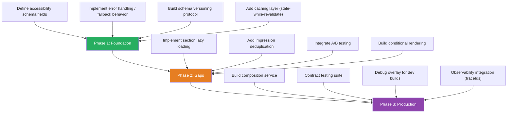

---

## Revision History

| Date | Summary |
|---|---|
| 2026-04-25 | Doc consistency audit. Atomic rendering layer row: added LiveClock, updated migrated count 9 → 10 (GamePanel added). §9g theming: override-matrix description qualified as hardcoded in resolvers (not read from `style-tokens.json` at runtime); `variant_override_blocked` coverage qualified as Android-only verified. |
| 2026-04-24 | Doc consistency audit. Corrected the variant-selector follow-up to the request-envelope `experiments` map; updated request-envelope support to include iOS; added the AtomicBox note to the theming row; and aligned current ErrorState / BoxscoreTable / Form status text with iOS runtime parity. |
| 2026-04-21 | Doc consistency audit. Section count 9 → 10 (added `VideoPlayer` as a permanent section — platform video SDK lifecycle: AVPlayer / ExoPlayer / HLS.js, PiP, AirPlay / Chromecast, background audio). Permanent-section inventory updated. ADR Status Summary adds ADR-011 (data classification and freshness, Proposed draft), ADR-012 (client data architecture, Proposed draft), ADR-013 (style tokens for atomic primitives, Accepted). §10 renderer rows updated to describe `IconTokenResolver` + server-declared navigation shells on Android, iOS, and web. |
| 2026-04-20 | iOS runtime parity with Android landed. §10 status updates: iOS renderer (SwiftUI) Designed → Built; Error handling & fallbacks (iOS `SectionErrorBoundary` + `SectionSkeleton`); Impression deduplication (iOS `ImpressionTracker` actor); Atomic rendering layer (iOS AtomicRouter + 9 primitives). |
| 2026-04-01 | Doc consistency audit. ADR Status Summary: renamed from "ADR Approvals Pending", added ADR-001 (Proposed) and ADR-010 (Proposed). §10 status: Accessibility descriptors Gap → Built. |
| 2026-03-30 | Doc consistency audit. ADR Approvals table: ADR-006 Proposed → Accepted. §10 status updated: Internationalization Gap → Built (section-level stringTable). |
| 2026-03-24 | Doc consistency audit. `FormRenderer` → `Form` aligned with schema enum in §9r classification table. ADR Approvals table: ADR-008 Proposed → Accepted (Option C), ADR-009 Proposed → Accepted. |
| 2026-03-14 | Added §9r (Section vs. Atomic Classification — implementation-level criteria: network-driven lifecycle, platform SDK integration, client-owned interaction state. Full classification inventory with concrete examples: GamePanel Ably/poll lifecycle, SubscribeHero/SubscribeBanner billing SDK, AdSlot ad SDK, BoxscoreTable scroll/sort state). Added §9s (Figma Design Token Integration — token mapping file, client-side resolution, three-level CI validation pipeline). |
| 2026-03-13 | Atomic rendering layer. Updated Key Schema Decisions (dual-layer model: 9 section types in schema (8 permanent + AtomicComposite) + 10 atomic element types; 9 former types migrated to server-composed AtomicComposite). Added Grid vs. Section Decision Tree to §9q. Added atomic rendering layer row to requirement status matrix. |
| 2026-03-04 | Added `parentUri` to Screen contract. Updated status matrix for composition API contract (Gap → Partial). Added Prototype Concessions subsection. |
| 2026-03-04 | Added gap section 9q: Tabular Data Sections and Forms. New semantic section types (`BoxscoreTable`, `Form`), parameterized refresh on actions, sort/form state conventions. Updated status matrix. |
| 2026-02-27 | Cross-document consistency review. Replaced `entitlements` references with `device` in governance, schema decisions, and 9o to align with Technical Proposal. |
| 2026-02-25 | Established platform-aware composition as settled architectural position: shared schema, shared data pipeline, per-platform-family composition responses. Renamed `fallbackUrl` → `webUrl` in action contract. Updated platform coverage, 9b, 9m. |
| 2026-02-25 | Added `stringKeys` to binding contract JSON example in section 3. Added JSON snippet with explanation to i18n section (9p). Added revision history. |
| 2026-02-24 | Added i18n requirement (9p) with two-layer strategy (server-resolved default + `stringKeys` on data bindings). Added locale transport policy to 9o (`locale` query param on GET, body on POST; `Accept-Language` rejected). |
| 2026-02-20 | Added gap sections 9m (form-factor layout manager), 9n (ad support), 9o (composition input and request model). Aligned governance and locked decisions with ADR-driven approach. |
| 2026-02-16 | Aligned with latest platform direction. Updated schema/runtime/model touchpoints, removed outdated references. |
| 2026-02-12 | Initial version — consolidated from design sessions. Separated implementation code into reference document. Core architecture, schema, data binding, action system, screen state, codegen, platform coverage, and gap analysis (9a–9l). |

---

## Appendix

### A. Implementation Reference

Detailed code implementations, visibility detection patterns, and schema definitions:
- **[sdui-implementation-reference.md](sdui-implementation-reference.md)** — Swift and Kotlin implementations for `SDUIImpressionTracker`, visibility detection wiring, and analytics impression schema.

---

*Document generated from SDUI design sessions — February 2025*
